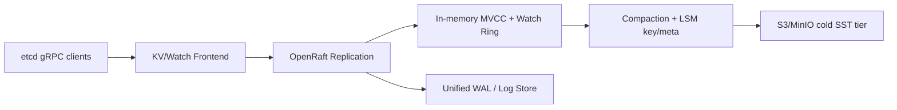

# Architecture

Astra combines strict CP semantics with low-latency write handling under constrained disks.

Canonical, actively maintained architecture docs:

- [Architecture Overview](./internals/architecture-overview)
- [Write Path](./internals/write-path)
- [Read Path](./internals/read-path)
- [Raft Timeline](./internals/raft-timeline)

## High-Level Design

## Why Astra Outperforms etcd in Target Scenarios

- Unified WAL with vectorized append and bounded linger.
- Queue-aware adaptive batching and byte-budgeted put packing.
- Semantic QoS lane for lease/lock prefixes under pressure.
- Read isolation and list prefetch controls to prevent write storms from collapsing read latency.
- Object-tiered compacted state with manifest-driven restore.

## Zero-Copy Watch Ring

Watch events are published from memory ring buffers instead of replaying from disk scans.
This keeps high fanout watch workloads detached from storage jitter.

## Semantic QoS

Tier-0 keys (for example lease/lock lanes) are classified and routed through a priority queue.
When normal lane pressure increases, Tier-0 writes bypass the stall path to protect control-plane liveness.

## Raft Stage Timeline

Astra emits timeline telemetry for enqueue, append, replication, quorum-ack, and apply stages.
These traces enable targeted tuning by identifying true idle gaps versus disk-bound stalls.
